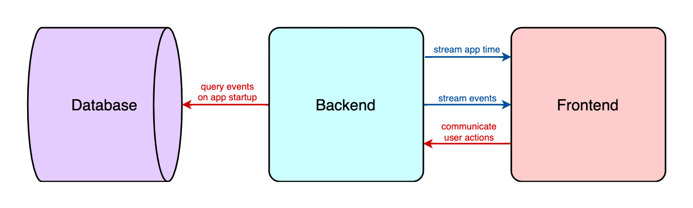

# Design

## Team 3

- Steven Capleton
- Landon Dyken
- Karen Horton
- Eric Latham
- Brittany Latham
- Laura Thompson

## Questions

### Backend

- How can we efficiently calculate derived measurements?
- How should we store user-generated events on the backend to be analyzed? We have to analyze pre-generated and user-generated events together to calculate derived measurements.

### Frontend

- What React libraries and other tools should we use to make the user interface?
- What are all the attributes of smart home state?
- What other components should be added?

## High-Level Runtime Model

Our smart home dashboard simulator is an event-based application that operates according to the following runtime model:



## Smart Home State

TODO

## Derived Measurements

Derived measurements are measurements derived from smart home state over time.

### Indoor Temperature

TODO

### HVAC Status

TODO

### Utility Usage

TODO

#### Previous Month

TODO

#### Current Month

TODO

## Events

An event is an object representing a change in smart home state at a certain point in time.

### Event Attributes

- `id` is the unique identifier of the event (a serial assigned by Postgres)
- `time` is the number of seconds after the start of app time at which the event occurred
- `stateKey` is the key to the value in the smart home state that the event changed
- `newValue` is the new value for `stateKey` in the smart home state after the event
- `message` is a human-readable description of the event to be displayed to the user

### Pre-Generated Events

Pre-generated events are the backbone of the smart home simulation. They:

- are generated ahead of time (before the app runs)
- are based on the provided family schedule and downloaded weather data
- define the base smart home state over a 2-month time period

### User-Generated Events

TODO

## Database Design

The database is only used for storing **pre-generated events**, and it does so using a table with the following structure:

```sql
CREATE TABLE PreGeneratedEvent
(
    id serial,
    time int,
    stateKey text,
    newValue json,
    message text
);
```

This design is space-efficient and also lends itself well to event-driven/reactive programming.

## Backend Design

### Important Concepts

#### Server-Sent Events

Server-sent events (SSE) provide an efficient and scalable alternative to traditional request models.

SSE can be leveraged to effectively "stream" events from the server to the client in many different contexts, which goes along with other reactive programming techniques.

The app facilitates SSE functionality based on [this guide](https://www.velotio.com/engineering-blog/how-to-implement-server-sent-events-using-python-flask-and-react).

##### Benefits

- The SSE model is a more efficient alternative to the request model; the request model would require the frontend to constantly send requests (thousands in our case) to the backend for updates, while the SSE model allows the frontend to simply subscribe to a message channel that the backend publishes events to.
- SSEs are less expensive and time-consuming than HTTP requests, so the SSE model allows the app to consume events faster and with more granularity to time.
- With the SSE model, the frontend will only need to send explicit requests to the backend for user actions.

### Classes

#### `AppClock`

The app clock represents time with flexible speed in a bounded (2-month) timeframe, and it is used to keep time in the app's simulation of smart home events.

The app clock allows:

- running the smart home simulation at different speeds
- changing speeds at runtime without losing the current place in time
- restarting app time from the minimum app time at any point

##### Minimum Speed

```txt
1  real second  =  1  app second
```

##### Maximum Speed

```txt
1   real minute   =  1          app month
60  real seconds  =  2,592,000  app seconds
1   real second   =  43,200     app seconds
```

#### `EventQueue`

The event queue is a custom queue data structure for storing and retrieving **pre-generated events**.

It stores all events provided to it while only allowing past events to be retrieved, which allows the app to poll the event queue at regular time intervals to get only the events that have "occurred" since the last poll.

Specifically, the event queue:

- is instantiable with a list of event objects queried from the database
- uses the app clock to determine if an event is a past or future event
- hides future events
- allows retrieving all unprocessed past events (to be processed)
- allows retrieving all processed past events (to be analyzed)
- allows resetting its pointer to `0` (when restarting the simulation)

When the app starts, it queries all events from the database into the event queue, which minimizes the number of queries and subsequently reduces network latency costs.

#### `SSEPublisher`

`SSEPublisher` is an abstract base class providing common functionality for the Flask-Redis SSE publishers used in the app.

It supports running a background job (in a background scheduler using a deamon thread) on an interval of real time or app time to publish objects as SSEs from a SSE-compatible Flask app.

Implementing classes just need to set the `eventTypeString` attribute and implement the `getObjectsToPublish` method.

#### `TimePublisher`

Inheriting from [SSEPublisher](#ssepublisher), the time publisher sends the **current app time** as a SSE to the frontend to be displayed every real second.

#### `EventPublisher`

Inheriting from [SSEPublisher](#ssepublisher), the event publisher sends all **unprocessed past events** from the event queue as SSEs to the frontend to be processed at every half-minute of app time.

#### `MeasurementsPublisher`

Inheriting from [SSEPublisher](#ssepublisher), the measurements publisher calculates and sends **derived measurements** as a SSE to the frontend to be displayed every real second.

## Frontend Design

### Important Concepts

TODO

### Components

#### `AppClock`

TODO

#### `SmartHome`

TODO
